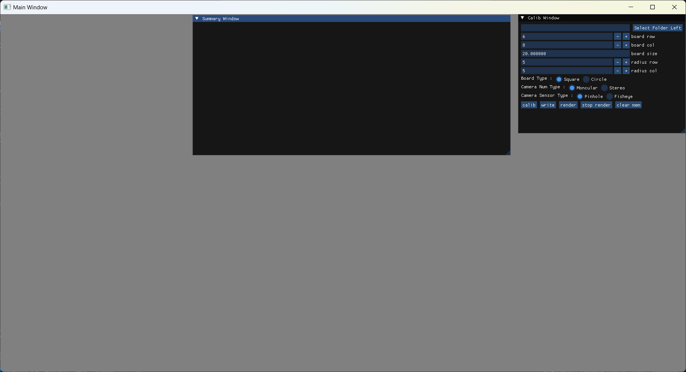
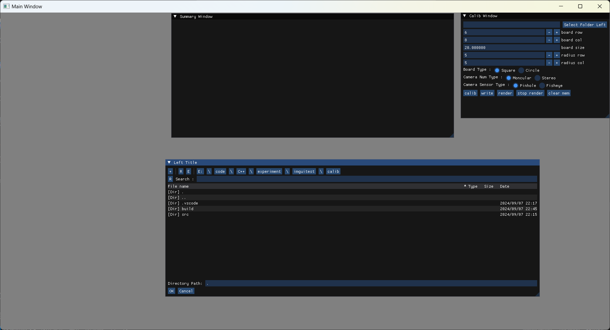
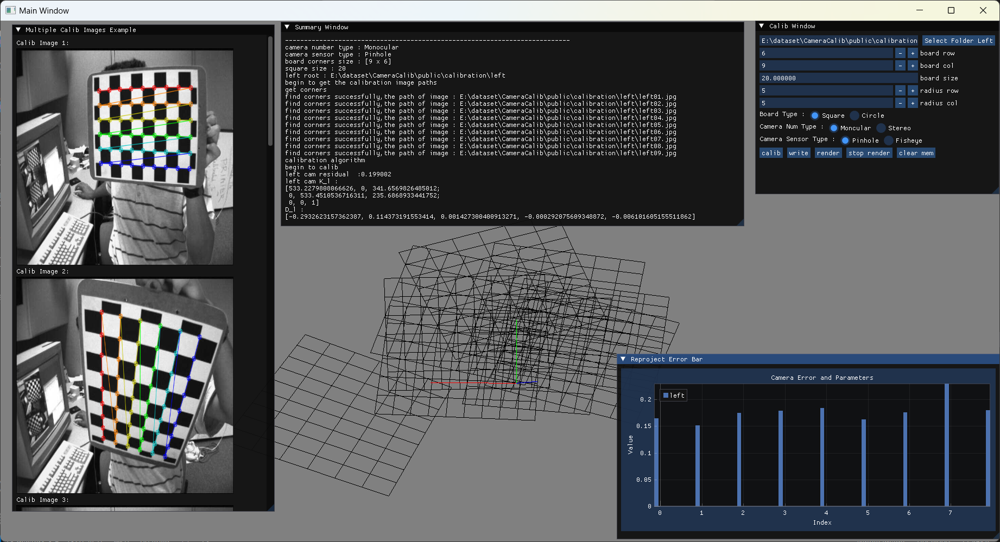
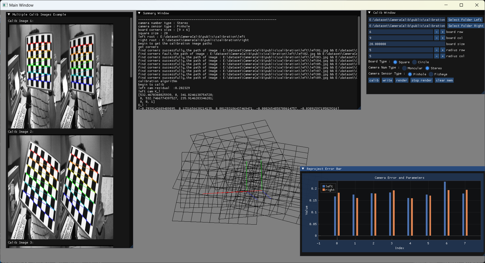

### 1.介绍
基于OpenCV和ImGui的相机标定程序。目前支持的相机类型有
* 按照相机数目
    * 单目
    * 双目
* 按照相机传感器类型
    * 针孔
    * 语言
同时，支持的棋盘格类型有
* 角点
* 原点（仅仅支持对称圆点）

### 2.环境依赖
* OpenCV 4.x
* ImGui 1.92
* OpenGL3
* glfw3
* glm


### 3.编译
如果你是 `Windows` 用户，那么请安装好 `vcpkg`，并且将依赖安装好，之后将 `vcpkg` 的工具链文件在 `CMakeLists.txt` 开始处设置好工具链，
```bash
set(VCPKG_ROOT "${vcpkg_path}/scripts/buildsystems/vcpkg.cmake")
set(CMAKE_TOOLCHAIN_FILE ${VCPKG_ROOT})
```
如果你是 `Linux` 用户，请在安装好依赖库后，删除关于 `vcpkg` 的相关语句，之后可以继续编译。移动到 `CMakeLists.txt` 同级的文件夹，直接在终端上运行指令
```bash
sh build.sh
```
或者手动
```bash
cmake -S . -B build
cmake --build ./build --config release -j
```

### 4.运行
在 `Windows` 上，用 `exe` 文件运行
```bash
./build/Release/test.exe
```
在 `Linux` 上运行
```bash
./build/test
```


### 5.结果可视化
<div align="center">
    
</div>

<div align="center">
    
</div>

<div align="center">
    
</div>

<div align="center">
    
</div>
